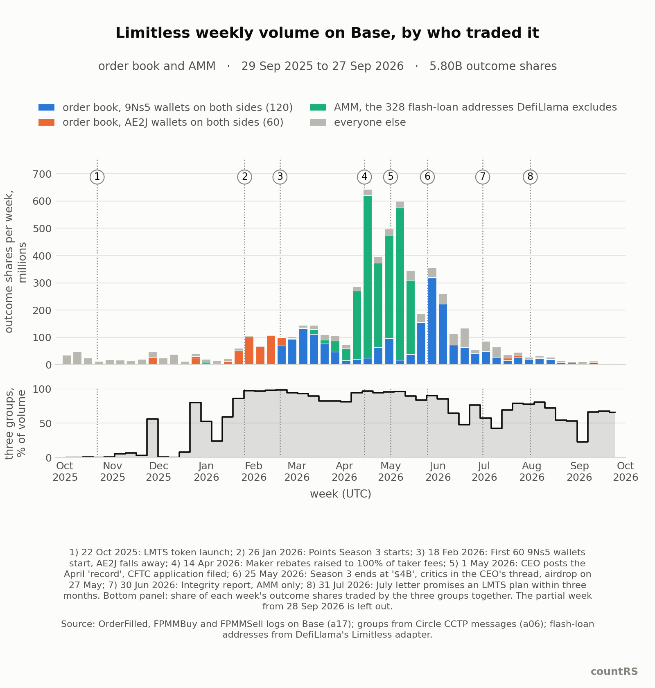
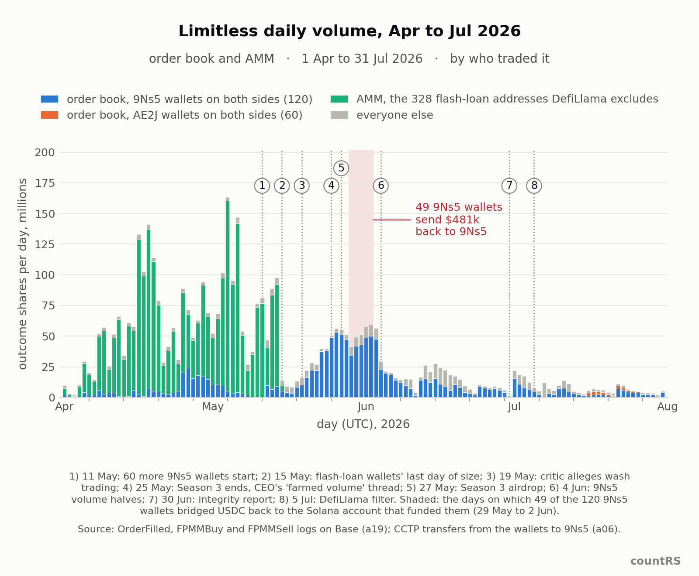
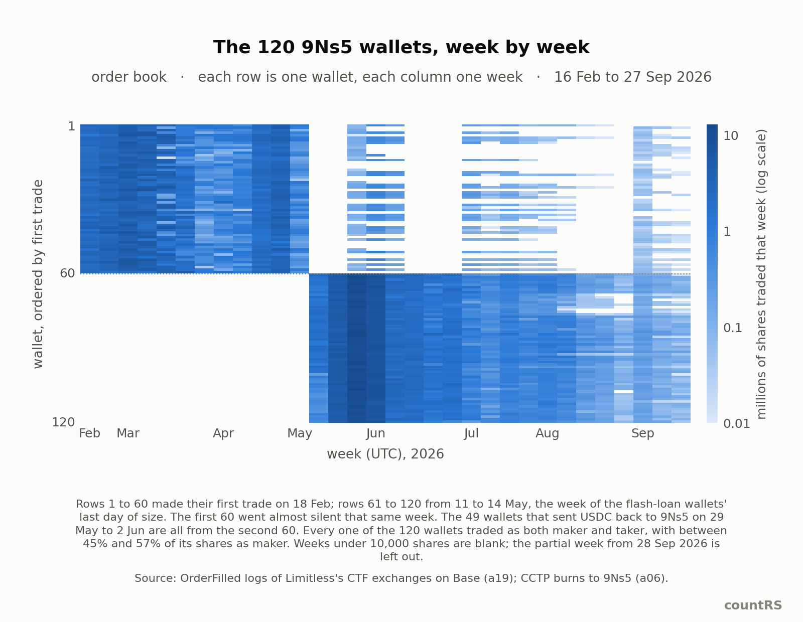
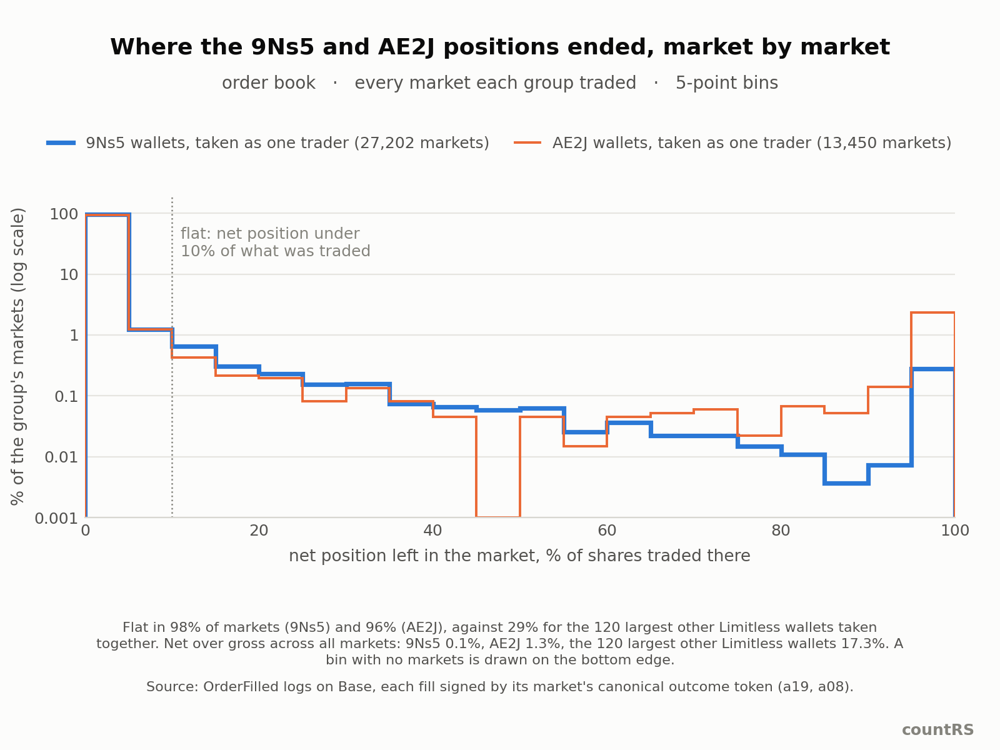
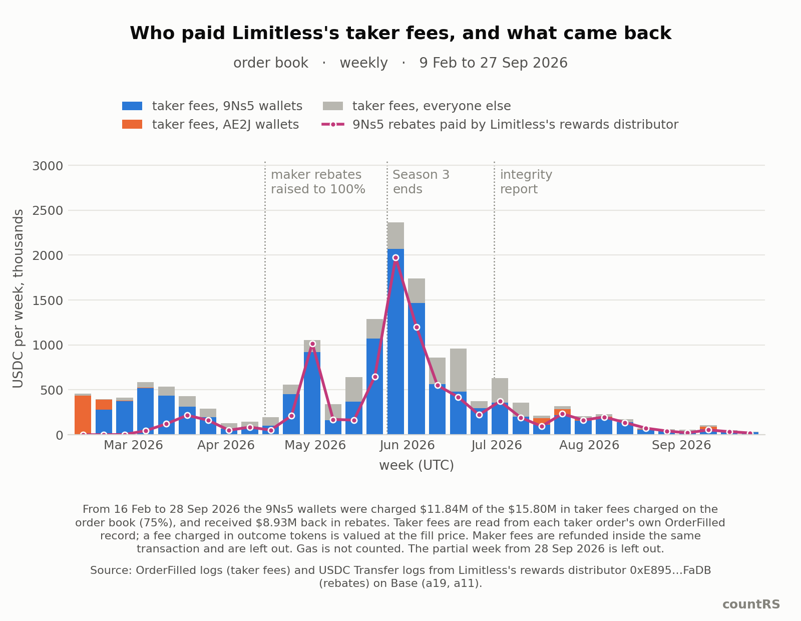
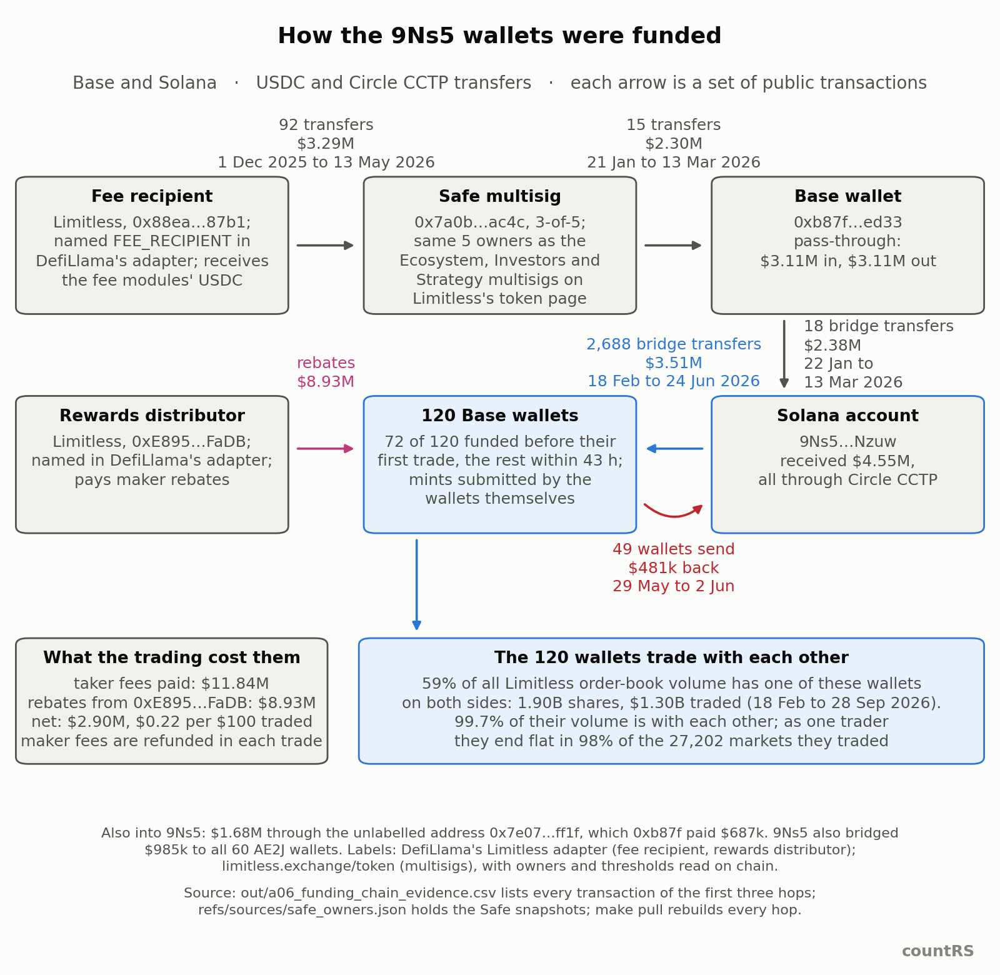
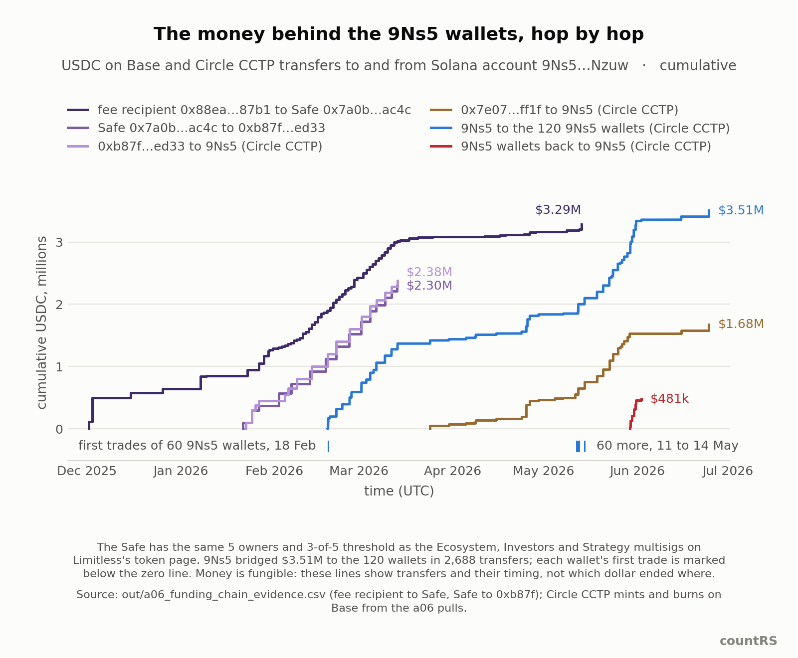

# The Issue with Incentives: The Limitless Case

Read [DISCLAIMER.md](DISCLAIMER.md) first.

## Summary

Prediction Markets, much like any other modern financial venue, are designed to incite activity. This may take shape in the form of fee rebates, airdrop points, and volume-based tiers. But it may also take the form of who pays fees, who creates liquidity, and how volume is reported. The latter form is the less popular but equally important set of incentives which ultimately drive the type of activity on any given exchange.

With only public data, this paper follows Limitless on Base and how their incentives and subsequent trading activity evolved through time. We rebuilt every order-book fill and AMM trade from Base logs, 6.07B outcome shares in all.

From mid-February to the end of June 2026, nine in ten shares traded on Limitless came from three groups of wallets. The first is the flash-loan scheme on its AMM markets that Limitless itself disclosed on 30 June, while the other two are groups of wallets on its order book funded through the same Solana account. The largest group of wallets traded 99.7% of its volume with itself and ended flat in 98% of the 27,202 markets it touched. In fact, it paid 75% of all taker fees charged on the order book from mid-February to September, \$11.84M of \$15.80M, and was paid \$8.93M back by Limitless's rewards distributor. Additionally, some of its funding passed through a multisig that shares its five signers with Limitless's own token multisigs.

Following the money on chain, an amount equal to 87% of the groups' fees that reached Limitless's fee recipient, and to 64% of all the taker fees they were charged, was later paid to wallets in the same groups, as rebates or as funding. Still, Limitless's April record month, its Season 3 total and its May figures are all real on-chain sums. However, between 92% and 95% of the shares in each came from these groups (76% to 85% of the dollars). When Season 3 ended and its airdrop was paid, the activity began slowing down, and suddenly the venue was only trading a few percent of its headline volume.

## Introduction

The first structural issue we identified through our previous posts was contract design and how misalignment on that front can entice malicious actors. Now, we focus on the incentive design, which is the second structural problem in prediction markets that we have written about (the first being contract design). In our posts on short-term crypto contracts ([part 1](https://x.com/TeodorTankov/status/2102741111752011850), [part 2](https://x.com/TeodorTankov/status/2103207721218855036), [part 3](https://x.com/TeodorTankov/status/2103865218501693906)) we showed how settlement on a single print and expiries of a few minutes make it cheap to move the reference price at the moment that decides the payout, and how a TWAP simply raises the cost of corruption.

This second problem is how venues are built to attract activity; a new market has no traders, hence some of the venue's activity is paid for. This can be done via fee rebates to maker orders, points that convert into token airdrops, referral and fee tiers set by the trader's own volume, and even trading competitions. However, some of these incentives aren't paid for at all (fees charged on one side only, self-trade blocking that checks a single profile etc.) The concern with these types of incentives despite their necessity in jumpstarting a market is the artificially reduced cost to trade without risk changing hands. Once that cost falls below what the trade earns (in the form of rebates, points or a better rank), the cheapest way to collect is to trade with yourself. As we put it in a [post in September](https://x.com/TeodorTankov/status/2103520926465753470), most volume on new markets comes from liquidity providers paid to hit targets which isn't exactly fake volume in itself but becomes misleading when a venue reports the volume and omits the cost of producing such volume. The real test of a liquidity program, in [Forecaster's words](https://x.com/0xForecaster/status/2103502498452906396) is what happens when the payments stop.

Limitless is far from an exception, as structures like these are standard on newer venues in prediction markets and across crypto. Limitless is where we can watch the test happen most clearly as everything is on chain where both sides of every trade carry a wallet and where the venue itself has published valuable information of the story.

To be clear, we are not accusing Limitless of taking part in any of this. Our view is about incentive design in general: when a venue's design makes it cheap and rewarding to inflate key metrics such as volume, it should be open about how those programs work and how much of its reported activity they produce. We think that incentives like these shape outcomes and that a venue using them needs to be clear about what it pays, how the programs work, and what part of its reported activity they produce.

## The incentives

### The main volume programs

Limitless ran the following programs during the period studied:

- **Fees fall on takers only.** In other words, makers trade for free and any maker fee is refunded inside the same transaction, while order-book taker fees run from 0.4-3% depending on probabilities while sells peak around 1.5% at 50 cents. Lastly, AMM trades pay a flat 0.40% ([fees](https://docs.limitless.exchange/user-guide/fees)).
- **Maker rebates of 100%.** On 14 April 2026 the rebate on daily, hourly and 15-minute crypto markets was raised to 100% of taker fees ([changelog](https://docs.limitless.exchange/changelog)); on 26 May Limitless [announced](https://x.com/trylimitless/status/2059222764553413019) it across all daily, hourly and minutely markets. Rebates are paid daily in USDC, pro rata to each maker's share of a market's maker volume ([maker rebates](https://docs.limitless.exchange/user-guide/maker-rebates)). An important note here is that the documentation describes no exclusion for fills where the same owner is on both sides.
- **Points that become an airdrop.** These are airdrop points which convert trading activity into a share of a future LMTS token airdrop. The most recent campaign, Season 3, ran from 26 January to 25 May 2026 ([Season 3 rules](https://limitless.exchange/blog/points-announcement)) and its airdrop of 3% of supply (30M LMTS) opened on 27 May ([announcement](https://x.com/trylimitless/status/2059605695989698701), [CEO](https://x.com/cjhtech/status/2059653295556169781)). It's also important to note that no season had ever published the size of the pool or the conversion formula in advance ([Season 4 rules](https://limitless.exchange/blog/points-season-4-announcement)).
- **Fees recovered by the liquidity provider.** In AMM markets, it's general practice for the liquidity provider to receive fees. In Limitless' case, they've said the same address could be both liquidity provider and trader and recover its fees ([June letter](https://limitless.exchange/blog/the-huddle-issue-01-jun-30th)).
- **Tiers set by the trader's own volume.** The referral program launched on 17 July 2026 ([announcement](https://x.com/trylimitless/status/2078153755472884068)) pays 10% to 40% of referred taker fees, and the tier depends on the referrer's own maker plus taker volume: 32% from \$1M and 40% from \$5M ([referral program](https://docs.limitless.exchange/user-guide/referral-program)). For instance, the World Cup campaign in June and July paid out of a pool of up to 1M USDC by XP earned from trading ([rules](https://cdn.limitless.exchange/road-to-legend/rules.pdf)).

Within Limitless, there exists just one control against the negative externalities potentially arising from the above points, and that is their self-trade prevention which stops an order from matching another order of the same profile. The developer documentation also states matching between two profiles one controls is considered wash trading ([responsible agents](https://docs.limitless.exchange/developers/responsible-agents)), but the issue here is that enforcement then depends on the venue detecting it after the fact.

Now, the most important thing to outline is: how do these reward systems actually introduce perverse incentives?

Let's do a quick example with a trader who holds two wallets, A and B, in one market:

- A posts an order, and B then takes it.
- B pays the taker fee, while A pays nothing and is refunded any maker fee.
- If A's wallets are most of the maker volume in that market (maker rebates are proportional to maker volume share), most of B's fee comes back to A.
- To unwind the position, the same transaction happens in reverse, where B now posts an order, and A takes it.
- At the end of the day the operator ends without a position yet has printed the volume twice, has earned points, referral tier and a place on the leaderboard in return for the net loss in gas fees and share of fees which went to other makers.

In AMM, it was even easier to perform similar activities, and Limitless has even reported on this type of behavior. Specifically, there was an actor that borrowed about \$1.12M through a Morpho flash loan, added it as the only liquidity in a market, bought \$9,999 and sold \$9,919 against itself, paid fees of 39.996 and 39.836 USDC, recovered 79.82 USDC as the liquidity provider, and repaid the loan ([example transaction](https://basescan.org/tx/0xe19542e6b7f50638eea02c43eca08f888f0e3b8848f55af727f92243caed443c)).

Now, without further ado, let's actually explore how this happened in practice.

## The Limitless timeline

Looking below at Figure 1, it's quite easy to notice the round trip weekly volume has taken as of recent.



*Figure 1. Weekly volume on Limitless, order book and AMM, by group, with the dated events.
The bottom panel shows the share traded by the flash-loan, 9Ns5 and AE2J wallets together (a17, a06).*

What we need to understand is: why did this rollercoaster of activity happen? And how can such a concentrated group of wallets be responsible for the majority of it?

### Before 2026

Prior to September 2025, Limitless was a relatively quiet exchange, trading under 8M shares a week, and under 2M in some months. After this point, however, Limitless activity began exploding from mid-September to the end of the year as it traded 12M to 56M a week. Following this momentum, the LMTS token launched on 22 October 2025 after a \$10M seed round. However, around this time is also when we saw our first group emerge; the first AE2J wallet traded on 15 September 2025, and the group became visible from late November. Each of these wallets turned on in quick succession after that first trade; 55 of the 60 wallets from the group made their first trade within four days. Over its whole life it traded 97% of its volume with itself and ended flat in 96% of the 13,450 markets it touched (a08, a19). Around this time, the flash-loan wallets also debuted as they made their first AMM trade in August 2025 and reached size in late December at 6.3M shares in the week of 22 December, staying under 45M a week until April (a17).

### February

From the week of 19 January AE2J stepped up its volume and began trading 51M to 107M shares a week, and cumulatively the three groups' share of Limitless volume rose above 80%, to 97% from late January (Figure 1, bottom).

However, some interesting developments transpired in the week of 16 February. Firstly, AE2J fell from 107M shares to 29M that week and to 2M the next. In addition, 60 new wallets funded by 9Ns5 started trading. All 60 made their first trade within 72 seconds of each other, between 18:21:43 and 18:22:55 UTC on 18 February (a19).

The money for those wallets began to arrive in the weeks before, specifically between 21 January and 13 March a Safe multisig, [`0x7a0b…ac4c`](https://basescan.org/address/0x7a0b16d55da33fa6bf1174532f33bba1914fac4c), sent \$2.30M in 15 transfers, mostly round \$100k and \$200k amounts, to [`0xb87f…ed33`](https://basescan.org/address/0xb87f6670c965be9ecda4f5c8bfa7f5576658ed33), which bridged \$2.38M to 9Ns5 in 18 transfers over the same weeks (a06). That Safe was itself funded by Limitless's fee recipient and shares its signers with Limitless's token multisigs. Section 4.4 traces every hop.

### March and April

From late February through mid-March the 9Ns5 wallets traded 78M to 133M shares a week. They paid \$0.60M in February and \$0.98M in March more in taker fees than they received back, and carried on (Table 2). On 14 April Limitless raised maker rebates on its crypto markets to 100% of taker fees. In the week of 27 April the 9Ns5 wallets were charged \$0.92M in taker fees and paid \$1.02M by the rewards distributor (Figure 5).

At the same time the AMM flash-loan wallets went from tens of millions of shares a week to hundreds of millions: 250M in the week of 6 April and 596M in the week of 13 April (a17). On 16 April the CEO [celebrated](https://x.com/cjhtech/status/2044800783539904983) traders painting a \$100M daily volume candle. April closed at 1.66B shares, of which 1.39B came from the flash-loan wallets, 0.18B from 9Ns5 and 0.08B, or 5%, from everyone else (a19). Nonetheless, this month of April stood to be Limitless' monthly volume peak as of current.

On 1 May the CEO [posted](https://x.com/cjhtech/status/2050266878749331653) over \$1.5B of monthly volume, \$20M of annualized revenue, and Limitless as the second largest onchain prediction market and third largest globally, and on the same day, Limitless's US subsidiary filed for designated contract market status with the CFTC ([CFTC filing](https://www.cftc.gov/IndustryOversight/IndustryFilings/TradingOrganizations/60686)). On 5 May DeFi Rate [reported](https://defirate.com/news/limitless-files-cftc-approval-after-record-1-66b-month/) the filing alongside the record \$1.66B month and \$3.9B of cumulative volume.

### May

Questions arose quickly, though, as on 11 May [DeFi Rate](https://defirate.com/news/kalshi-sets-weekly-high-4-1b-volume-polymarket-slides/) noted that Limitless's weekly fees had fallen 79.6% while its notional rose and suspected inflated volume among the possible reasons. On 19 May the X account TheNotoriousSKi [asked](https://x.com/TheNotoriousSKi/status/2056862335927722348) how Limitless lost 40% of its volume in a week, and alleged wash trading on the venue. The claims rested on volume having fallen from 600M shares in the week of 4 May to 346M the next week. It's important to note that this was also the period where flash-loan wallets fell from 559M to 271M and the rest of the venue rose (a17). In quick succession, another (implicit) allegation arose, as on 21 May an account writing as Polymarket [asked](https://x.com/primo_data/status/2057529381325820245) why Limitless's notional for the week of 4 May was 13 times its taker volume when Polymarket's was about 2 times. The same day Limitless [asked](https://x.com/trylimitless/status/2057400331428900947) the market makers on its books to fill in a feedback survey.

While this was unfolding, the first set of 60 wallets began to wind down (99% decrease in weekly activity seen in Figure 3). The flash-loan wallets were also experiencing an unwind, having traded their last day of size as seen in Figure 2. However, between 11 and 14 May, a second set of 60 wallets funded by 9Ns5 made their first trades. These 9Ns5 wallets (the new set) picked up the slack having gone from 3M-5M daily shares on 15 to 17 May all the way to 53M on 26 May (a19).

Alas, we see the end of Season 3 on 25 May, and on that very day, Limitless [announced](https://x.com/trylimitless/status/2059026219593544133) \$4B of traded volume, 280,000 active traders and 4.5M trades for the season. This enabled them to [tout themselves](https://x.com/trylimitless/status/2058931786881622504) as the fastest-growing prediction market in the world on a three-month growth of 345%. The CEO doubled down on this stance and [opened a thread](https://x.com/cjhtech/status/2058952687668904218) with the line that haters say Limitless volume is farmed while Polymarket spent more on rewards in one month than Limitless had raised. In the replies, TheNotoriousSKi [posted](https://x.com/TheNotoriousSKi/status/2059055361714454618) an example it described as wash trading: one address adding liquidity, buying, selling and removing liquidity across seven markets in the same block. The CEO's reply on the notional ratio was that it would improve as the marketplace matured. On 26 May the same account [alleged](https://x.com/TheNotoriousSKi/status/2059085342222020849) that the volume came from a single airdrop farmer.

As the airdrop opened on the 27 May, the CEO [wrote](https://x.com/cjhtech/status/2059706939383107868) that liquidity was rising with strong improvements in depth and spread. The next day, Limitless [posted](https://x.com/trylimitless/status/2060126972735615074) a record \$3.37M in monthly fees, a top-five fee generator on Base, and the day after that the CEO [posted](https://x.com/cjhtech/status/2060367118172852411) \$3.4M of May trading fee revenue and a \$40M annualized run rate. However, one must take into account that 79% of those monthly taker fees in May were charged to the 9Ns5 wallets (a19).

A strong pullback then ensued between 29 May and 2 June as 49 of the 120 wallets sent \$481k back to the Solana account that funded them in 162 CCTP transfers. The 9Ns5 wallets' trades with each other rapidly dwindled from 45M shares a day until 3 June as it halved on 4 June and kept falling (Figure 2).



*Figure 2. Daily volume on Limitless from April to July 2026, by group, with the dated events and the days on which the 9Ns5 wallets sent USDC back to their funder (a19, a06).*

### June

On 4 June Limitless [claimed](https://x.com/trylimitless/status/2062522004084076784) \$40M of annualized revenue, up 140% on April, over a third-party ranking that called LMTS the most efficiently valued token by valuation to revenue. It then [called](https://x.com/trylimitless/status/2064336208386314586) itself a top 20 protocol by monthly earnings and [said](https://x.com/trylimitless/status/2064471097173819459) more than \$7M had been distributed back to traders in three months. It also stated on 10 June that it was the [only](https://x.com/trylimitless/status/2064835749757825410) prediction market with 100% maker rebates. This entire period was filled to the brim with self-acknowledgements of the previous activity feats Limitless had achieved.

Out of nowhere at the end of June, Limitless releases a June letter with a market integrity report ([blog](https://limitless.exchange/blog/the-huddle-issue-01-jun-30th), [X](https://x.com/trylimitless/status/2072082414805856691)). Specifically, this report states that they found a single account manufacturing fake volume and removed all of it from public stats. The report was describing the flash-loan scheme on AMM markets (the ones we've addressed above) and puts it at \$2.7B of notional across more than 1,000 trades. Limitless naturally follows up these discoveries by saying the accounts were banned along with the points they've received, calling it abuse of the points program.

However, there are issues with this report, or rather missing information which doesn't paint the full picture. Firstly, within the report, Limitless describes itself as a hybrid order book and AMM venue yet they only report abuse in AMM markets. The issue with that is none of the 180 9Ns5 and AE2J wallets ever traded on the AMM, and none are among the banned addresses (a19). Secondly, the flash-loan wallets only traded at size up until six weeks prior to the report. Lastly, it didn't restate the April record, the \$3.9B, the Season 3 \$4B or the rank claims, which can be naturally problematic for true transparency of figures.

### July to September

From this point onwards, Limitless began to experience a cooldown of sorts. The 9Ns5 wallets kept trading after the report 15M to 30M shares a week in July and under 10M by September (a17), and their rebates covered most or all of their fees (Figure 5). Even AE2J came back in July, albeit at small size. As their activity fell, so did the venue's volume with 377M shares in July to September together against 1.71B in May alone (a19).

On 21 July the CEO [acknowledged](https://x.com/cjhtech/status/2079392619705381219) heavy LMTS sell pressure and promised a plan. The plan was revealed on 31 July via the [July letter](https://limitless.exchange/blog/the-huddle-issue-02-july-31th) which set three months to expand where the token trades and clarify its link to the company. Additionally, on 23 July Limitless [said](https://x.com/trylimitless/status/2080314745077243985) it had paid \$9.2M of maker rebates in four months. Lastly, as we checked the docs on 28 September, the rewards page showed a 30% rebate on the BTC and ETH 5 and 15-minute markets and on some others ([rewards](https://limitless.exchange/rewards?view=rebates)), while the documentation still describes 100%, we couldn't find an announcement of the change.

## Anatomy of the 9Ns5 group

Although the AMM flash wallets and AE2J wallets are important in the overall story, for the time period we wish to study in depth it is the 9Ns5 group which appears most salient.

### Funding

9Ns5 is a Solana account which has bridged \$3.51M to 120 Base wallets in 2,688 CCTP transfers between 18 February and 24 June. Throughout these transfers, the receiving wallet always submitted the mint itself, and 72 of the 120 received their first transfer before their first trade (the other 48 were within 43 hours after it). The wallets themselves came in two sets of 60:

- The first set bridged \$1.85M and made its first trades within 72 seconds of each other on 18 February.
- The second set was bridged \$1.66M and started between 11 and 14 May as the first went quiet (Figure 3).



*Figure 3. The 120 wallets funded by 9Ns5, one row per wallet and one column per week, coloured by the shares each wallet traded that week (a19).*

### Trading with itself

Trades with a 9Ns5 wallet on both sides come out to 59% of all shares ever traded on Limitless's order book, and 99.7% of trades the 120 wallets took were against another of the 120 (a08).

Every wallet from the 9Ns5 collection traded both as maker and as taker, and the maker share of their volume lies between 45% and 57% (a19). The volume is dispersed quite well across all 5,363 maker and taker pairs with busiest ten pairs representing 1.6% of their total volume. And as you probably would have imagined, the same address almost never matches against itself (0.16% of order-book volume (a08)) as this is the type of trade self-trade prevention by profile is capable of detecting.

To illustrate what type of behavior we're dealing with, we've got a brief example: on 26 May between 12:10 and 12:55 UTC, the market with condition `0xa44137…2a61` printed 856 fills and 333,574 shares on one outcome token. As you probably would have guessed, 99.9% of those shares were traded between 9Ns5 wallets, and 104 of the 120 wallets in the group participated. At 12:10:09 wallet `0x106f…6bac` bought 490.014 shares at 74.7 cents from `0x8180…5e00` ([transaction](https://basescan.org/tx/0xeb3f70a7cd90d7b1ab4ef3ac561fd075b5b4653629ddd802f5993afafa4ffa00)), and a mere 24 seconds later it sold 475.000 shares back to the same wallet at 73.9 cents ([transaction](https://basescan.org/tx/0xb7fc5c984797d07054ca9139c0cf2a905bc13af242cd94121c335904ab59da0f)). This pattern of buying a fractional amount and then selling a round amount back to the same counterparty seconds later was repeated amongst a multitude of pairs.

The most glaring part is that as a group, the net position across all of the wallets is 0.1% of their gross volume (Figure 4, Table 1). Contrary to popular belief, a market maker does in fact normally carry inventory, and this group carries none. Even if you don't treat the group as a single trader, the 9Ns5 wallets ended flat in 90% of their market positions (96% weighted by volume).

**Table 1.** Self-trading and net position by group, each group taken as one trader (a08).

| Group | Within the group | Flat markets | Net / gross |
|---|---|---|---|
| 9Ns5, 120 wallets | 99.7% | 98% | 0.1% |
| AE2J, 60 wallets | 97% | 96% | 1.3% |
| Top 120 other Limitless wallets | 48% | 29% | 17.3% |



*Figure 4. Net position left in each market as a share of the shares traded there, for the 9Ns5 and AE2J wallets each taken as one trader (a19, a08).*

### Costs

From 16 February to 28 September the 9Ns5 wallets were charged 75% of the \$15.80M in taker fees charged on Limitless's order book and were also paid \$8.93M by Limitless's rewards distributor, [`0xE895…FaDB`](https://basescan.org/address/0xE895CaE6B705d584b03cd82Fdd57cf7F8c52FaDB) (a19, a11), and their net cost was 0.22% of the \$1.30B they traded excluding gas. Table 2 gives us a strong picture of the activity originating from the 9Ns5 wallets.

**Table 2.** What the 9Ns5 wallets paid and got back, by month (a11).
Taker fees are read from each taker order's own fill record; maker fees are refunded in the same transaction and left out.
The monthly taker fees here are by calendar month and differ slightly from the weekly sums in a19.

| Month, 2026 | Traded (USDC) | Taker fees | Rebates received | Net cost |
|---|---|---|---|---|
| February | \$124.2M | \$0.60M | \$0.00M | \$0.60M |
| March | \$317.1M | \$1.55M | \$0.57M | \$0.98M |
| April | \$95.7M | \$1.30M | \$1.07M | \$0.23M |
| May | \$350.1M | \$3.96M | \$3.28M | \$0.69M |
| June | \$277.2M | \$2.83M | \$2.55M | \$0.28M |
| July | \$84.7M | \$0.96M | \$0.84M | \$0.11M |
| August | \$42.5M | \$0.49M | \$0.49M | \$0.00M |
| September | \$10.5M | \$0.14M | \$0.13M | \$0.01M |
| Total | \$1,302.1M | \$11.84M | \$8.93M | \$2.90M |

To really put into perspective the amount of rebates being received, when Limitless said on 9 June that more than \$7M had been distributed back to traders in three months, 89% of that sum went to 9Ns5 wallets, and on 23 July, when they paid \$9.2M in maker rebates in four months, 84% of that went to the 9Ns5. On both occasions, most of the rebates Limitless announced went to the 9Ns5 wallets.



*Figure 5. Weekly taker fees on Limitless's order book, the part charged to the 9Ns5 wallets, and the USDC the rewards distributor paid them (a19).*

### Where did the money come from?

Figure 6 provides a general overview, but to elaborate on some of the nuances we provided a little summary below:



*Figure 6. The funding chain behind the 9Ns5 wallets.
Every arrow is a set of public transactions (a06).*

1. **Fee recipient to Safe.** The flow of funds begins with Limitless' fee recipient, [`0x88ea…87b1`](https://basescan.org/address/0x88eaf31f9fE392002e0E818527f8259af92287b1), which sent \$3.29M to the Safe `0x7a0b…ac4c` in 92 transfers from 1 December 2025 to 13 May 2026.
2. **The Safe's owners.** The Safe is particularly interesting because it has the same five owners and the same 3-of-5 threshold as the three multisigs Limitless labels on its [token page](https://limitless.exchange/token) as its Strategy, Investors and Ecosystem wallets. The Safe rarely makes appearances in this story, but it does show up at the first and last fee-recipient transfer and at the end of the study window (`refs/sources/safe_owners.json`).
3. **Safe to `0xb87f`.** The Safe went on to send \$2.30M to `0xb87f…ed33` in 15 transfers between 21 January and 13 March (for example [\$200,000 on 24 January](https://basescan.org/tx/0xad256b7eb06113980d1a32fc5ac8d56a6f7c31ba9f3d71c156589fb53fc13676)).
4. **`0xb87f` to 9Ns5.** After that, `0xb87f` would continue to bridge \$2.38M to 9Ns5 through CCTP in 18 transfers between 22 January and 13 March.
5. **The rest.** Besides the natural flow we described above, \$1.68M came from [`0x7e07…ff1f`](https://basescan.org/address/0x7e07a9148e9149e430c6412b79a675028595ff1f) between 24 March and 24 June, an address `0xb87f` had paid \$687k. `0xb87f` also received \$687k from `0xee7a…4055` and smaller sums from two other addresses.
6. **9Ns5 to the wallets and back.** Finally, to conclude, 9Ns5 sent \$3.51M to the 120 wallets and \$985k to the 60 AE2J wallets, and received \$481k back from 49 of the 120 between 29 May and 2 June.

What this chain shows is that the 9Ns5 wallets received part of their funding from `0xb87f`, an address that had itself been paid by a Safe with the same signers as Limitless's token multisigs, and that the Safe was funded by Limitless's fee recipient. It's important to establish that on-chain records don't prove 9Ns5 and `0xb87f` belong to Limitless or to a third party that Limitless paid (for instance, a market maker).



*Figure 7. The same chain over time: cumulative USDC through each hop, with each wallet's first trade marked (a06, a19).*

### Where did the fees go?

Over the order book's whole history the 9Ns5 and AE2J wallets were charged approx. 77% of the \$18.24M of taker fees. The fee modules keep the taker fee of each trade and pass it on to the fee recipient `0x88ea…87b1`, which received \$13.72M of fee USDC by 28 September. To approach this cleanly, we interpret the taker fees generated by the 9Ns5 and AE2J wallets to be in proportion to their share of cumulative taker fees. On that basis, an amount equal to 68% of the groups' fees that reached the fee recipient was paid to the groups' wallets as rebates, and 19% as funding through the route above: 87% in all, or 64% of all the taker fees the groups were charged. The rest went to other addresses.

## Discrepancy between claim and chain

**Table 3.** Limitless volume claims against on-chain outcome shares, order book and AMM combined.
The three groups are the flash-loan, 9Ns5 and AE2J wallets.
Earlier claims, from July and October 2025, match the chain within 0.9 to 1.3 times, on shares or on dollars, whichever is closer.
The 20 April press figure and Bernstein's figure name no month; they are set against the last full month before publication (a17).

| Claim | Claimed | On chain | Three groups | Everyone else | Else, share |
|---|---|---|---|---|---|
| Monthly, press (20 April; vs March) | \$1B | 0.54B | 0.47B | 0.07B | 13% |
| April 2026 volume (CEO, 1 May) | over \$1.5B | 1.66B | 1.58B | 0.08B | 5% |
| April notional (Dune, reported 5 May) | \$1.66B | 1.66B | 1.58B | 0.08B | 5% |
| Cumulative to 1 May (reported 5 May) | \$3.9B | 3.41B | 2.65B | 0.76B | 22% |
| Season 3, 26 Jan to 25 May (25 May) | \$4B | 4.08B | 3.81B | 0.27B | 7% |
| Monthly, Bernstein (17 June; vs May) | close to \$2B | 1.71B | 1.57B | 0.14B | 8% |

## Objections

*Isn't this just ordinary market making?*

On a high level, a market maker's job is to trade with the public and, when necessary (it almost always is), to carry inventory. The 9Ns5 wallets practically traded all of their volume with each other and ended flat in 98% of their markets. Furthermore, if we compare that behavior with the other 120 largest wallets on Limitless, we see that they traded just 48% of their volume with each other and ended flat in 29% of markets (a08).

*Why couldn't this be a bunch of independent traders who just happened to use the same bridge account?*

The 120 wallets were funded from one Solana account and the first 60 made their first trade within 72 seconds of each other. 49 of the second 60 sent money back to that account between 29 May and 2 June. Normally, we'd be willing to concede this possibility but one can't deny the sheer improbability of a coincidence here.

*But didn't Limitless disclose this exact problem?*

While they did indeed disclose the AMM scheme, they did so six weeks after it ended. Most importantly, that disclosure didn't include anything about the order book, restatement of their figures or whether the banned wallets received airdrop tokens.

## Limits

Given the magnitude of this piece, it's important to draw limits on what can be drawn from our research. Firstly, evidence of a shared funder does nothing apart from establish the relationship between wallets; it certainly doesn't tell us who those wallets may be. Additionally, although self-trading across wallets is generally considered wash trading by Limitless, the determinant in the legality of self-trading is ownership and intent which we can't establish from public data. Lastly, we don't consider gas within our investigations, and the inclusion of their costs may yield different results in some areas.

## Conclusion

Once again, it's unfair to bash Limitless in particular when these types of reward systems are running rampant across all prediction market and crypto venues alike. The only thing we wish to blame, as always, are the poor incentive structures which can ultimately undermine transparency and legitimacy within exchanges along with the figures they publish. What we want to achieve here is a more thorough understanding of exchanges' 'invisible' incentive structures which can completely alter the appearance of any given exchanges' health. This added level of accountability would enable stakeholders to comprehend what's really going on underneath the hood and would incentivize venues to recognize and address perverse behavior as quickly as possible. Being on the blockchain is fantastic because it enables transparency of this sort, but we all still need to be capable of putting together the pieces.

## Data

**Trades.** We rebuilt every `OrderFilled` event on the six exchange contracts named in DefiLlama's Limitless adapter (order book), with the taker order's own record removed, and every `FPMMBuy` and `FPMMSell` event on markets created by Limitless's two AMM factories. The order book holds 11.8M maker fills and 3.22B outcome shares from February 2025 to September 2026 (a16); the AMM adds 2.84B shares (a19). With the flash-loan wallets removed, our April total is the 263.5M shares in DefiLlama's adjusted series, while with them included it's the 1.66B that DeFi Rate reported from Dune (Section 5, a17). Interestingly enough, every source ends at Base block 51,907,242, 28 September 2026.

**Units.** Volume is reported in outcome shares, which is what prediction market dashboards call notional: a share bought at 20 cents is one share of notional and 20 cents of USDC. The issue with this approach is that shares weight cheap trades heavily. For instance, the flash-loan wallets traded at about 8 cents a share. However, once one converts this volume to dollar amounts, the three groups made 80% of Limitless's volume from mid-February to June instead of 90%, and 66% of its whole history instead of 80% (a17). For the future, where dollars matter we give USDC.

**Groups.** The way in which we segmented trading activity is as follows:

- **Flash-loan wallets**: the 328 addresses DefiLlama excludes following Limitless's report ([DefiLlama PR #7969](https://github.com/DefiLlama/dimension-adapters/pull/7969)), on the AMM.
- **9Ns5 and AE2J**: Base wallets funded through Circle's CCTP bridge from two Solana accounts, [`9Ns5BaAG…4Nzuw`](https://solscan.io/account/9Ns5BaAG2oWJB2C1PgEpHeC3rBXLqJEmZKt7TQi4Nzuw) and [`AE2Jnkh…STb5d`](https://solscan.io/account/AE2JnkhVsi6Zu1pHCMah2JYjeugCEBiNYDn11q2STb5d). Of the 188 wallets that traded at least 10M shares on the order book, these are the only accounts that bridged USDC to 20 or more, and they bridged to 180 of them. The 180 started trading in two waves that almost never trade with each other (0.0015% of the volume within the 180): 120 wallets from February 2026 funded only by 9Ns5, and 60 from September 2025, all funded by 9Ns5 and 40 of them first by AE2J. Each wave is a group named after the account of its first bridge transfer (a06), and we consider a fill in a group when both sides are among its wallets.
- **Everyone else**: these are all the other trades including the few where only one side is a group wallet.

**Public record.** Statements by Limitless, its CEO, its critics, analysts and the press are cited by link in the text and kept with retrieval dates and a credibility grade in `paper/refs/limitless_evidence.jsonl`.

## Estimators

**Group of a fill.** For a maker fill with maker $m$ and taker $t$, the fill is inside group $G$ when both $m$ and $t$ are in $G$.

**Net and gross per market.** Each fill is signed by the market's canonical outcome token, so buying one outcome and selling the other agree. For a group taken as one trader, the net position in a market is the sum of its members' signed shares, with fills inside the group contributing zero net, and gross is the sum of shares on every side where a member appears, so a fill inside the group counts twice in gross. a08 also reports gross with each fill counted once, and flatness per wallet. A market is flat when $|\mathrm{net}| < 0.1 \times \mathrm{gross}$ (a08, a19).

**Fees and rebates.** Taker fees are read from the taker order's own `OrderFilled` record; a fee charged in outcome tokens is valued at the fill price. Rebates are USDC transfers from the rewards distributor to group wallets. Net cost is taker fees minus rebates (a11, a19).

## Evidence

- Flash-loan example from Limitless's report: [`0xe19542…443c`](https://basescan.org/tx/0xe19542e6b7f50638eea02c43eca08f888f0e3b8848f55af727f92243caed443c).
- Critic's example of 25 May: [`0x02e712…0eee`](https://basescan.org/tx/0x02e71256253919dbb522ec8cc6aefa003b5223efeb4e2b2087c1e6df82f40eee).
- First fee recipient to Safe transfer, 1 December 2025: [`0x433aa1…3060`](https://basescan.org/tx/0x433aa1da65cc64ff0be7d75ab7ddc43f4f8838e02340be12989f8bb9db8e3060).
- First Safe to `0xb87f` transfer, 21 January 2026: [`0x4aeb65…f842`](https://basescan.org/tx/0x4aeb6542c38640122c7eec452ea723f9dc1a76b22a5499a6b85d73fd9f19f842).
- First `0xb87f` bridge burn to 9Ns5, 22 January 2026: [`0xd4ce8b…1f7d`](https://basescan.org/tx/0xd4ce8bd303feeb1c083ea9da532f344e64e8e140c5d926c1c683c22678541f7d).
- A 9Ns5 bridge mint to a group wallet: [`0x953b53…590f`](https://basescan.org/tx/0x953b53db11a6493ecfd60391171106a4e61f52821bae6d8faebd95e1b3e9590f).
- DefiLlama adapter history: [PR #6576](https://github.com/DefiLlama/dimension-adapters/pull/6576) (AMM fees counted as revenue, 28 April), [PR #7969](https://github.com/DefiLlama/dimension-adapters/pull/7969) (flash-loan filter, 5 July), [PR #8676](https://github.com/DefiLlama/dimension-adapters/pull/8676) (rebates booked as supply side, 10 August).
- Every other public statement cited here, with its retrieval date and credibility grade: `paper/refs/limitless_evidence.jsonl`.

## Replication

`make harvest` rebuilds every fill and AMM trade from Base logs, `make pull` every bridge mint, burn and USDC transfer the funding and fee analysis uses, and `make analysis` every number and figure from those. The scripts are in `paper/analysis/`: a16 (order-book volume), a17 (claims and weekly series), a06 (funding and clusters), a08 (self-trading and flat positions), a11 (fees and rebates), a19 (daily, wallet, market and fee detail), a20 (the figures of Sections 3 and 4) and a21 (where the fees went).

---

## Repository

### What is here

| Path | Contents |
|---|---|
| `py/` | `chain.py`, every address, block and path the code shares; harvesters for order-book fills and AMM trades, and the pulls for wallet funding, group transfers, the fee trail, the Safe owners and Binance prices, from public Base and Ethereum logs and calls |
| `paper/analysis/` | One script per result, each writing `paper/out/<name>.json` with the run time attached, plus `common.py` (the shared helpers, and the constants from `py/chain.py`) and the two figure scripts with `style.py` |
| `paper/out/` | Results, and `a06_funding_chain_evidence.csv`, which lists every transaction of the first three hops of the funding chain |
| `paper/fig/` | Figures, built by `a06_limitless_figure.py` and `a20_limitless_figures.py` from `paper/out/`, `paper/refs/sources/safe_owners.json` and two pulls |
| `paper/refs/` | The evidence ledger (`limitless_evidence.jsonl`, one record per public source), the research dossier, saved copies of key public sources, and the Safe owners read from the chain |
| `paper/limitless.tex` | The paper; `paper/tex2readme.py` turns it into this README |
| `CLAUDE.md` | Instructions for Claude to explain the results and reproduce them |

The study window ends at Base block 51,907,242 (28 September 2026, 13:57 UTC) for every source.

### Pulls

| Script | What it pulls |
|---|---|
| `harvest_limitless`, `harvest_limitless_amm` | Every order-book fill and AMM trade |
| `pull_funders` | Every Circle CCTP mint into the wallets on at least 10M order-book shares, decoded to its source chain, depositor and submitter |
| `pull_cluster_usdc_in` | Every USDC transfer into the group wallets |
| `pull_fee_trail` | USDC through Limitless's fee recipient, 0x6661, the rewards distributor, the Safe and the addresses between it and 9Ns5; CCTP burns to 9Ns5; every USDC transfer out of the group wallets |
| `safe_owners` | Owners and threshold of the Safe and of Limitless's three labelled multisigs, at the first and last fee-recipient transfer and at the end of the window |
| `pull_binance` | Binance daily ETH and BTC closes, to price the few early AMM trades settled in WETH or cbBTC |
| `watch_pull` | Not a pull: a live progress bar for a HyperSync pull running in another process |

### Scripts

| Script | Question |
|---|---|
| `a06_limitless_clusters` | Wallets funded through Circle CCTP by the same Solana accounts, split into the two waves that started trading, and the volume they trade with each other |
| `a16_limitless_volume` | Order-book volume by day and month, concentration, self-crossing, reciprocal and flat shares |
| `a17_limitless_claims` | Each dated volume claim by Limitless or the press, against the on-chain total, with and without the addresses DefiLlama excludes as flash-loan wash traders |
| `a17_limitless_weekly` | Weekly volume on both venues by group, each claim split by group in shares and USD, and the groups' share over the windows the paper names |
| `a08_self_crossing` | How much volume has one party on both sides, and whether each group, and each wallet, ends each market flat |
| `a11_fee_timeline` | What the groups paid in fees and received back in rebates, by month |
| `a06_limitless_flow` | The funding chain behind 9Ns5, hop by hop, and who funded the AE2J wallets before the bridge |
| `a19_limitless_anatomy` | Daily volume by group, per-wallet maker and taker volume, per-market net positions, price and size profiles, weekly taker fees and rebates. Runs in pieces (`--groups a:b`, then a plain run) to stay within a few GB of memory |
| `a19_amm_daily` | Daily AMM volume, flash-loan wallets and the rest; whether the group wallets ever used the AMM or are on DefiLlama's list |
| `a19_market_example` | The 26 May market used as the worked example in Section 4, fill by fill |
| `a21_fee_trail` | Where the fees the groups paid went, and the groups' USDC ledger |
| `a06_limitless_figure`, `a20_limitless_figures` | The figures |

### Reproducing

Needs Python 3.9 to 3.12, a free [Envio HyperSync](https://envio.dev) token, about 16 GB of memory for the largest steps, and [tectonic](https://tectonic-typesetting.github.io) for the PDF.

```
python3 -m venv .venv && .venv/bin/pip install -r requirements.txt
echo "ENVIO_API_TOKEN=..." > .env      # Free Envio HyperSync token.
make harvest                            # Several GB into data/.
make pull                               # A few hours on the free HyperSync plan.
make analysis                           # About ten minutes.
make paper readme
```

The Makefile uses `.venv/bin/python`; pass `PY=...` to use another interpreter. `pull_binance` calls api.binance.com, which refuses US addresses. Raw chain data is not committed: it is large and fully regenerated by `make harvest` and `make pull`.

### Licence

The code is under the MIT License and the paper, results and documentation under CC BY 4.0; see `LICENSE.md` and `DISCLAIMER.md`.
